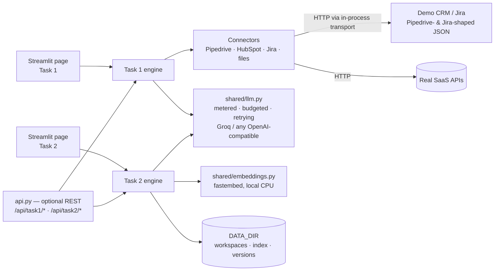
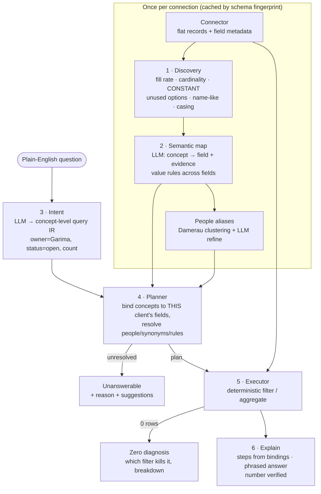
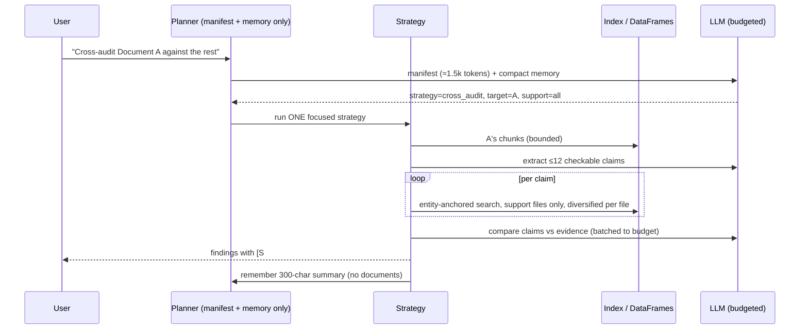

# Architecture

One Streamlit app (plus an optional REST API), two products, one shared LLM layer. All diagrams are Mermaid (render on GitHub).



---

## Task 1 — Semantic Business Data Translation Layer

### The idea in one sentence
Separate **what the user means** (concepts: owner, status, priority…) from **where this client keeps it** (fields, stages, tags, typos), learn the second part automatically from the data's *statistics*, and let deterministic code do the counting.



**Why it survives messy reality**

| Messy pattern in the brief | What the system does |
|---|---|
| *Invented fields* — official owner blank/shared, real owner hand-typed in "Assigned To" | Discovery flags the official field as `CONSTANT` (one value on every record) and the custom field as `name_like` + `inconsistent_spelling`; the map picks the custom field with evidence; alias clustering merges "Garima", "G. Sharma", "Garmia", "garima sharma ". |
| *Hidden meanings* — nothing marked lost, deals parked in "Dead Leads" while status says open | Discovery reports the `Lost` option as **NEVER USED**; the map defines `lost = stage ∈ {Dead Leads}` and `open = status ∈ {Open} AND stage ∉ {Dead Leads}` as a cross-field **rule**, which the executor evaluates. |
| *Scattered logic* — priority in a built-in field for one client, in tags for another | Concepts are open-ended per client: the CRM map binds `priority → label` (tags with "hot 🔥/urgent"), the Jira map binds `priority → Priority`. Same question code. |
| *Mismatched vocabulary* — "assigned to" vs "Lead Owner" | The intent step speaks concepts; the planner maps `owner` to `Lead Owner` on the persons collection and to `Assigned To` on deals. Synonyms (active/live/in play → open, dead/abandoned → lost) are resolved before binding. |
| *A misleading "0"* | Three distinct outcomes: `answer`, `empty_with_reason` (per-filter counts + breakdown of what the data holds instead), `unanswerable` (concept not tracked anywhere, with the closest field). |

**Trust**: every step in "How I got this" is generated from the plan's bindings and the executor's counts — the model only phrases the one-line answer, and its output is rejected if the computed number is not in it.

**Adding a tool** = one class with `load() -> list[Collection]` (see `task1/adapters/jira.py`, 90 lines). No field maps, no per-tool prompts.

---

## Task 2 — Enterprise Document Workspace

### The four roadblocks → four mechanisms

```mermaid
flowchart LR
  subgraph upload["Upload ONCE"]
    F[Files / ZIP] --> H{SHA-256<br/>seen before?}
    H -->|yes| DUP[skip · 0 tokens]
    H -->|no| PARSE[Parse once<br/>PDF · DOCX · XLSX (hidden sheets, formulas) · CSV]
    PARSE --> UNITS[(Addressable units<br/>p12 · t0 · Sheet!r21-40)]
    PARSE --> FRAMES[(DataFrames per sheet)]
    UNITS --> IDX[(Hybrid index<br/>BM25 + local embeddings)]
    UNITS --> MAN[(Manifest<br/>1–2 lines per file)]
  end
```



| Roadblock | Mechanism | Where |
|---|---|---|
| **Repeated upload cost** | Workspace with SHA-256 dedupe; ZIP expansion; re-uploading 30 files costs 0 LLM tokens. Parsed units, DataFrames and vectors persist on disk. | `task2/workspace.py`, `ingest.py` |
| **Information overload** | The model never sees "all files". The planner sees only the manifest; strategies retrieve bounded passages (`LLM_CONTEXT_BUDGET`); spreadsheets are **queried with SQL** (schema + 3 sample rows in the prompt, DuckDB does the arithmetic); hidden sheets are indexed and flagged so "hidden clauses" are findable. | `planner.py`, `answer.py`, `tables.py`, `parsers/xlsx.py` |
| **Re-read tax** | Conversation memory is a list of ≤12 compact turn summaries (question, strategy, files, 300-char outcome) — enough to resolve "now change it in that document", never the documents themselves. Follow-ups re-hit the index, not the files. | `workspace.py::remember/memory_text` |
| **File corruption** | The model emits **operations** (`replace_text p8`, `update_rows Invoices where Vendor=…`, `add_sheet`), never bytes. python-docx / openpyxl apply them on a copy; a validator re-opens the result and checks invariants (sheets, formulas, VBA, merged ranges, tables, images, headers). Failures are discarded; successes become a new **version** next to the untouched original. Workbooks with charts/pivots are refused up front. | `editor/*.py` |

### Targeted interaction: edit one document out of 50

```mermaid
flowchart TD
  Q(["'Change payment terms to 45 days in the Nimbus contract'"]) --> PL[Planner → strategy=edit, target=Nimbus contract]
  PL --> CTX[Context = target's units (id | text)<br/>+ ≤4 supporting passages if other docs are referenced]
  CTX --> OPS[LLM → JSON ops<br/>replace_text p8 'within 30 days' → 'within 45 days']
  OPS --> APPLY[python-docx applies ops on a copy<br/>run-level replace keeps bold/italic]
  APPLY --> VAL{Validate<br/>zip integrity · reopen · invariants}
  VAL -->|fail| DROP[discard temp file, report why]
  VAL -->|ok| VER[new version v2 stored + indexed<br/>original untouched · download link]
```

Cost of that turn on the demo corpus: ≈3.3k tokens vs ≈28k to send the workspace — and identical whether the workspace has 16 files or 500, because only the target's units enter the prompt.

### Safe Excel/Word updates

* **Word**: paragraph/table ids come from parsing (`p12`, `t0`) and index into the same python-docx objects at edit time. `replace_text` works inside runs (formatting preserved); inserted paragraphs clone the neighbour's properties. Validation: `document.xml`/`styles.xml` present, tables/images/headers not lost, paragraph count matches expectation.
* **Excel**: `keep_vba=True` for `.xlsm` (macros survive); formula cells are never overwritten by value ops (an explicit `set_formula` is required); `fullCalcOnLoad` makes Excel recompute on open. Validation: sheet names, formula count, VBA part, merged ranges compared with the original. Pre-flight refuses workbooks containing `xl/charts`, `xl/drawings`, `xl/pivotTables`, `xl/embeddings` because openpyxl drops them.
* **Generation**: the model returns a content spec (`{title, sections:[{heading, paragraphs, bullets, table}]}` / `{sheets:[{name, columns, rows}]}`); code builds the file; the same validator runs before the download link appears.

---

## Tech stack & why

| Need | Choice | Why (cost + quality) |
|---|---|---|
| LLM | Groq `openai/gpt-oss-120b` (reasoning) + `gpt-oss-20b` (cheap steps) via the OpenAI SDK | Fast, cheap, JSON mode; swapping provider = one env var. `reasoning_effort` is tuned per step (low for routing/phrasing, medium for mapping/auditing). |
| Token control | `shared/llm.py`: per-request metering, conservative token estimate (3 chars/token), `LLM_CONTEXT_BUDGET`, 429 back-off | Every response shows real usage vs the naive cost; nothing can silently balloon. |
| Text search (Word/PDF) | **rank-bm25** (lexical) + **fastembed** `bge-small-en-v1.5` (local ONNX embeddings), reciprocal-rank fusion, SQLite + NumPy storage | Hybrid catches both exact terms ("NS-2026-02", "Net 45") and paraphrases; local embeddings cost nothing per query and need no vector DB service. Scoped search enforces "focus on Document A". |
| Large tables (Excel/CSV) | **openpyxl** (parse, formulas, hidden sheets, edit) + **pandas** + **DuckDB** (SQL) | The model writes SQL against a schema; the database aggregates 50,000 rows for the same token cost as 50. Row blocks are also indexed so clauses in spreadsheets are searchable. |
| PDF | **PyMuPDF** | Fast, accurate text extraction, page-level locations for citations. |
| Word | **python-docx** | Stable object model; run-level edits keep formatting. |
| UI | **Streamlit** (multipage) | Deploys free on Streamlit Community Cloud; no frontend build; the engines are called in-process. An optional **FastAPI** `api.py` exposes the same engines for scripting. |
| CRM/PM connectors | **httpx** against Pipedrive v1 / HubSpot v3 / Jira v3 | Thin adapters; the demo sources answer the same adapters through an in-process `httpx` transport with real-shaped JSON, so the demo exercises the production code path. |
| Fuzzy matching | **rapidfuzz** (WRatio, Damerau-Levenshtein) | Deterministic alias resolution for typos/initials before any LLM is involved. |

---

## Execution workflow (Task 2, step by step)

1. **User uploads 50 files once** (or a ZIP). Each file is hashed; duplicates are skipped. New files are parsed into addressable units, spreadsheets into DataFrames, everything indexed (BM25 + embeddings). A background call writes one-line summaries (6 files per call) into the manifest.
2. **User asks "cross-audit Document A against the rest".** The planner reads only the manifest and the compact memory (≈1.5k tokens) and returns `strategy=cross_audit, target=A, support=all`.
3. **System pulls the right data without re-reading everything.** A's units are loaded from the index (bounded). The model extracts ≤12 checkable claims. For each claim, the index is searched *only in the support files*, with entity-anchored queries and per-file diversification; evidence passages are trimmed and batched to the context budget.
4. **System answers with citations** (`[S7] Invoice Register FY26.xlsx (sheet Invoices, rows 2-21)`), lists discrepancies / consistent / not-verifiable, and shows the cost meter. A 300-character summary is remembered.
5. **User says "now change the payment terms in A to what the register shows".** The planner resolves "A" from memory, selects `edit`, and the model receives A's units plus the relevant register rows. It returns operations; python-docx applies them; the validator checks the result; **A v2** appears next to the untouched original with a download link and is indexed for the next question.
6. **User asks for a memo.** `generate` gathers the relevant passages and prior findings, the model returns a content spec, python-docx builds the file, validation passes, the memo joins the workspace.
